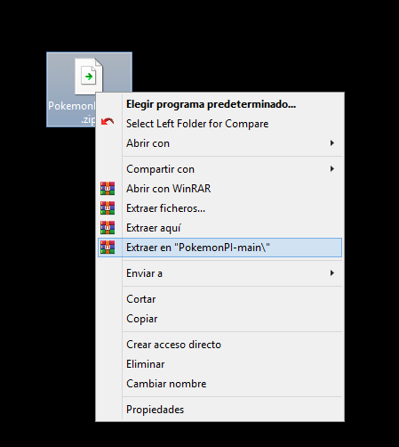
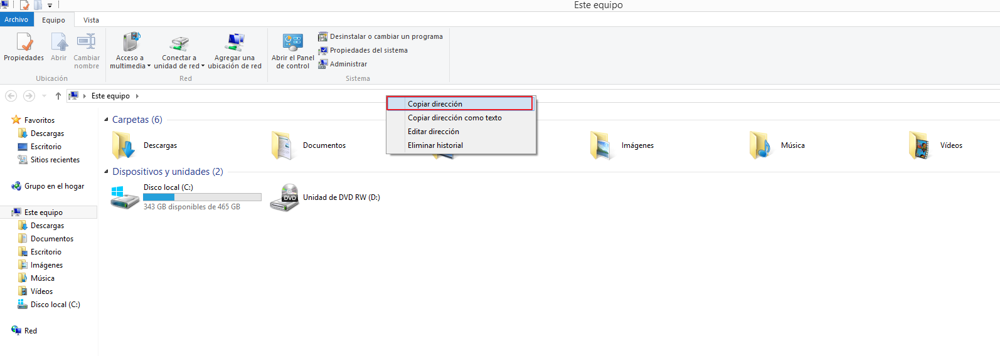
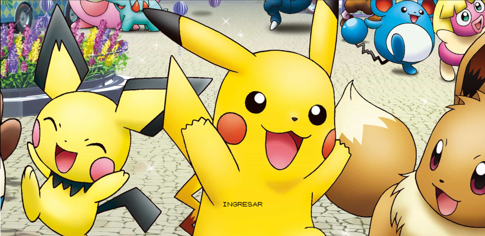
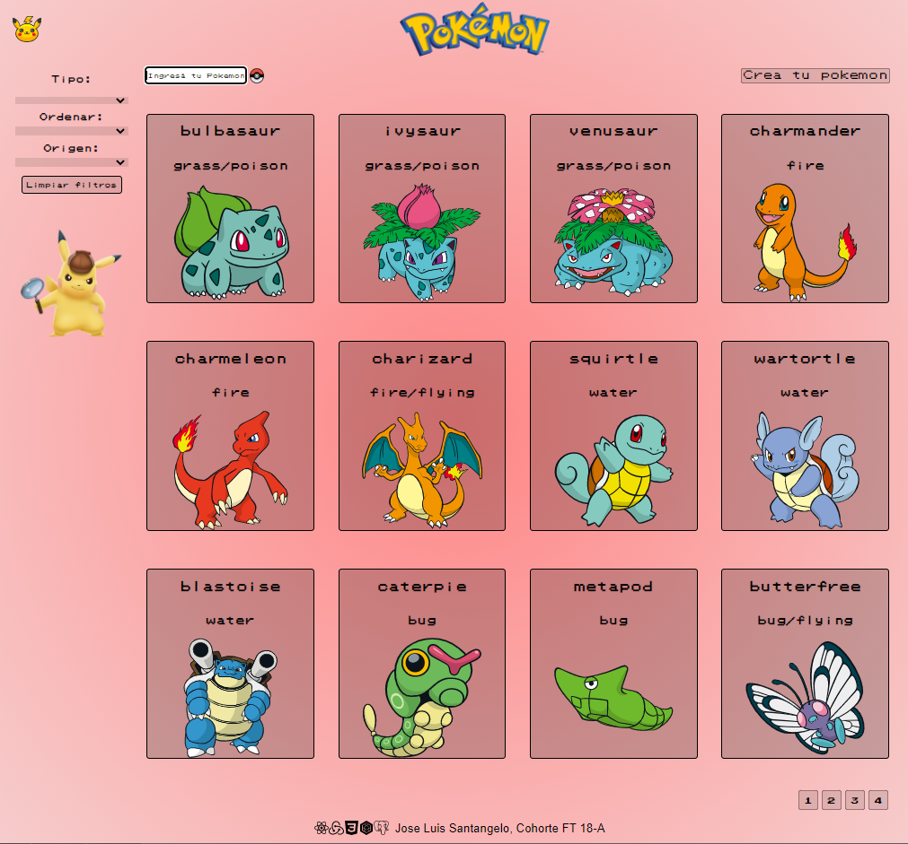
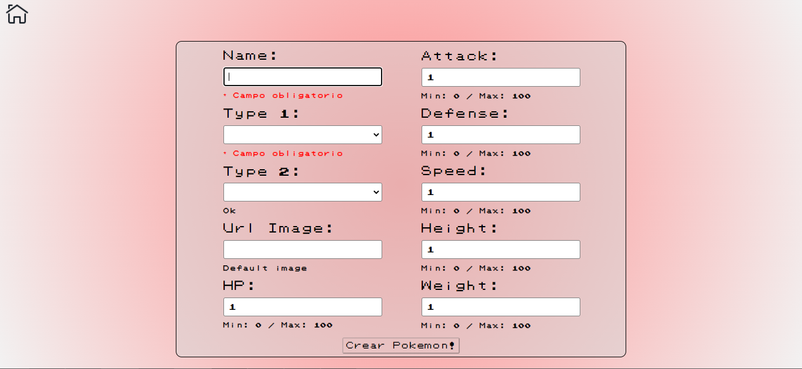
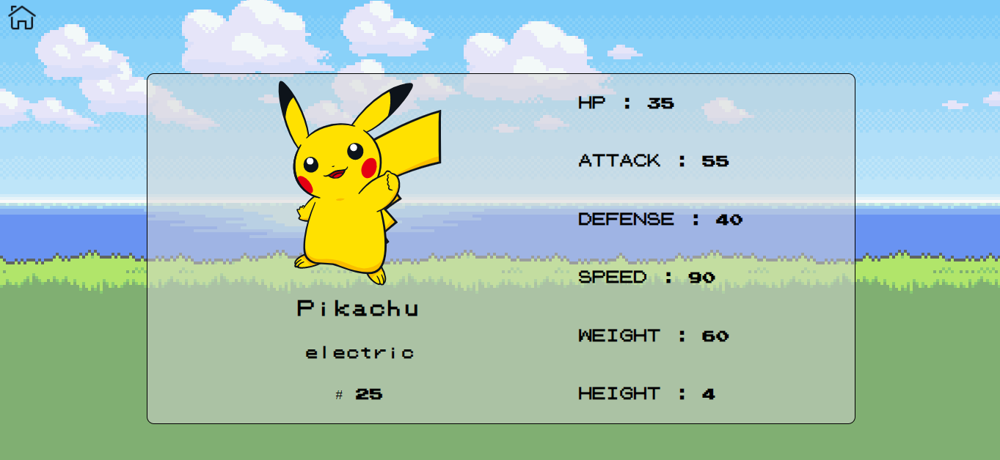

    

# Individual Project - Henry Pokemon

  

## Objetivos del Proyecto

- Construir una App utlizando React, Redux, Node y Sequelize.
- Afirmar y conectar los conceptos aprendidos en la carrera.
- Aprender mejores prácticas.
- Aprender y practicar el workflow de GIT.
- Usar y practicar testing.

## Como instalar el proyecto

- Desde mi repositorio, clickear en "Code" y luego en "Download ZIP".

  

- Descomprimir el archivo en una carpeta con el mismo nombre

  

- Desde una consola (puede ser la de Visual Studio, Cmder, etc) ingresar a la raiz del proyecto con el comando "cd" seguido del directorio del proyecto. Este se obtiene haciendo click derecho en la barra de busqueda dentro de la carpeta del proyecto y luego copiando el texto. Descargar Cmder >>> https://cmder.net/

  

- Una vez dentro de la raiz del proyecto, escribir en la consola el comando "npm install" y esperar a que termine el proceso (puede durar varios minutos)

- Una vez el proceso haya terminado, abrir otra pestaña de la consola que estes utilizando.

- En la pestaña 1, ejecutar el comando "cd" seguido de la ruta de la carpeta "api" del proyecto.

- En la pestaña 2, repetir el mismo proceso con la ruta de la carpeta "client".

- Cuando esten abiertos ambos directorios, ejecutar el comando "npm start" en la pestaña 1, y luego de unos segundos, en la pestaña 2.

- En aproximadamente 1 minuto se va a abrir automaticamente una pestaña del navegador, en la cual podras probar la app. Espero que te guste! Dejo algunas fotos a modo de adelanto.

  

 

  

 

  

 

  

